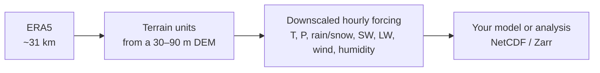

# TopoPyScale 2

TopoPyScale 2 (TPS2) downscales coarse climate reanalysis (ERA5, about 31&nbsp;km per grid
cell) onto real mountain terrain. It groups the terrain into units of similar elevation,
slope, aspect and sky view, and gives each unit its own hourly forcing: temperature,
humidity, wind, shortwave and longwave radiation, and precipitation split into rain and snow.

TPS2 is a ground-up rewrite of [TopoPyScale](https://github.com/ArcticSnow/TopoPyScale)
(Filhol et al.), with the physics kernels in Python and Rust.

## Where to start

-   **See it without installing**

    One page, one season above Davos: each forcing variable on the terrain, against
    elevation, and through the season.

    [:octicons-arrow-right-24: The demo](get-started/index.md#see-it-without-installing)

-   **Run it**

    Install, then set up and run a domain from a local web page (`tps2 ui`) or the command line.

    [:octicons-arrow-right-24: Get started](get-started/index.md)

-   **Know what it does**

    The downscaling algorithms and the data model.

    [:octicons-arrow-right-24: Downscaling algorithms](downscaling_algorithms.md)

-   **Know where it is wrong**

    Measured limitations, with numbers, so a result can be judged before it is relied on.

    [:octicons-arrow-right-24: Known limitations](known_limitations.md)

-   **Look something up**

    Every command and configuration key, generated from the code.

    [:octicons-arrow-right-24: Reference](reference/index.md)

-   **What comes next**

    Snow models, station validation, data assimilation, climate scenarios.

    [:octicons-arrow-right-24: Roadmap](roadmap.md)

## This release

This is a static snapshot of the downscaling engine. It is developed privately and published
as releases; the [Roadmap](roadmap.md) lists what exists in development and will follow.
Questions, bugs and feature requests are welcome as GitHub issues (see
[Contributing](contributing.md)).
